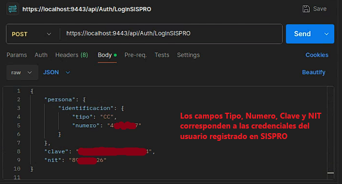
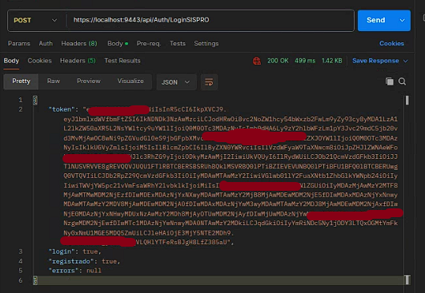
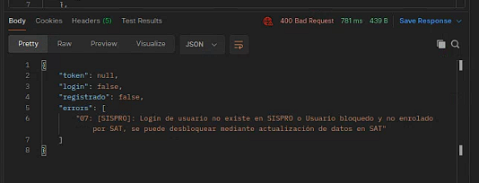

# 🚀 **FEVRIPS Ubuntu** 🚀

¡Bienvenido al repositorio para la configuración de Docker de la API local de FEVRIPS en Ubuntu! Este proyecto proporciona una configuración completa para ejecutar la base de datos y la API utilizando Docker.

---

## 🛠 **Configuración del Entorno**

Este repositorio incluye una plantilla de Docker Compose para desplegar los siguientes servicios:

- **Base de Datos SQL Server**
- **API Local FEVRIPS**

### 🎯 **Versión del Proyecto**

- **Versión de Docker Compose:** 3.8
- **Versión de API:** 4.1.1

---

## 🔩 **Instrucciones de Configuración**

1. **Login en Azure Container Registry**

   ```bash
   docker login -u puller -p v1GLVFn6pWoNrQWgEzmx7MYsf1r7TKJQo+kwadvffq+ACRA3mLxs fevripsacr.azurecr.io

---

## 💿 **Descargar la imagen de la API local de FEVRIPS**

2. **Este comando descarga la última versión de la imagen Docker de la API local desde el Azure Container Registry**

   ```bash
   docker pull fevripsacr.azurecr.io/minsalud.fevrips.apilocal:latest

---

## 🔌 **Iniciar los Servicios**

3. **Para iniciar los servicios, usa el siguiente comando**

   ```bash
   docker-compose -f apilocal-dockercompose.yml up -d

   
## 🚀 **Consumir el API usando POSTMAN** 🚀




## 🚀 **Al iniciar sesión correctamente se nos retornara un JWT** 🚀



## 🚀 **Credenciales incorrectas o Usuario no encontrado** 🚀




# 🛠 Generador de Firma Digital en Ubuntu 🛠

Este script en Bash te permite generar certificados digitales en formato PFX, utilizando OpenSSL. Incluye un menú interactivo para guiar al usuario a través de las opciones de creación y visualización de certificados.

## 📋 Requisitos Previos

Asegúrate de tener instaladas las siguientes herramientas en tu sistema Ubuntu:

- **OpenSSL**
- **Whiptail** (para la interfaz de usuario en modo texto)

Puedes instalarlas ejecutando los siguientes comandos:

```bash
sudo apt update && sudo apt install openssl whiptail -y
